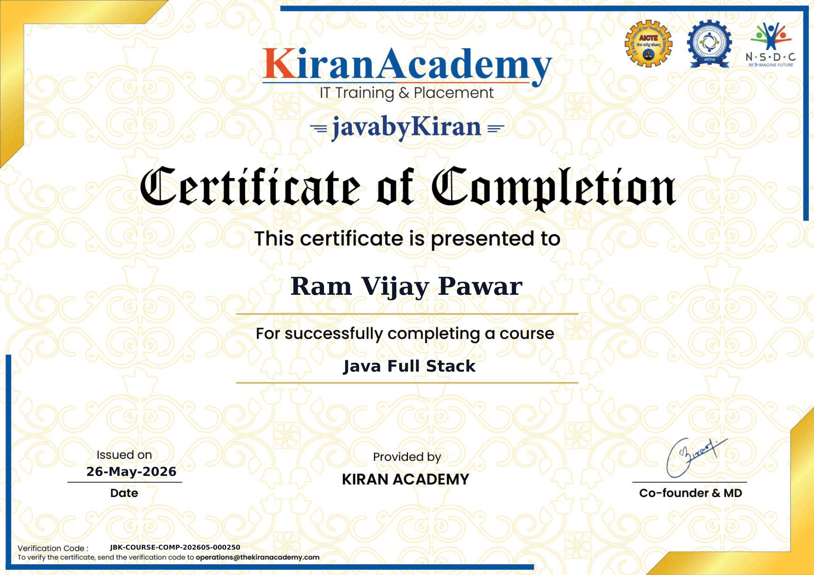
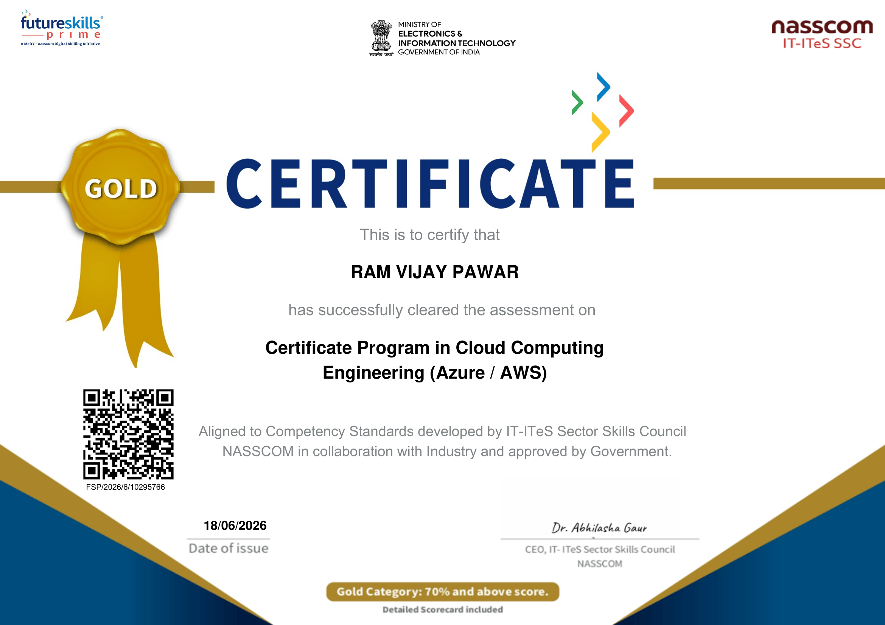
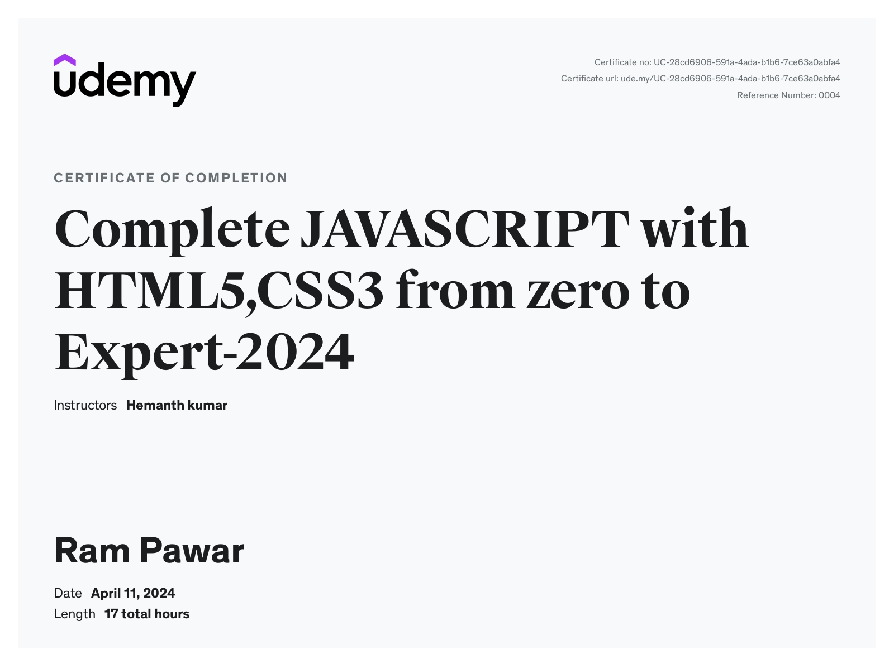
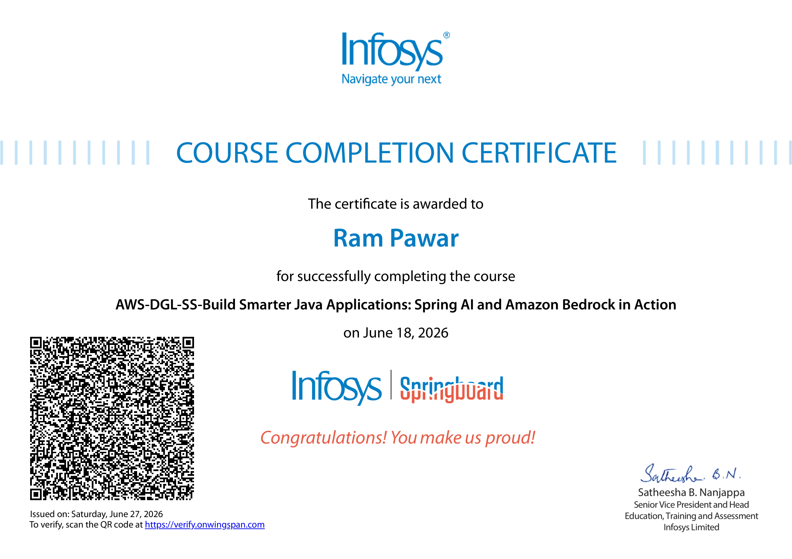
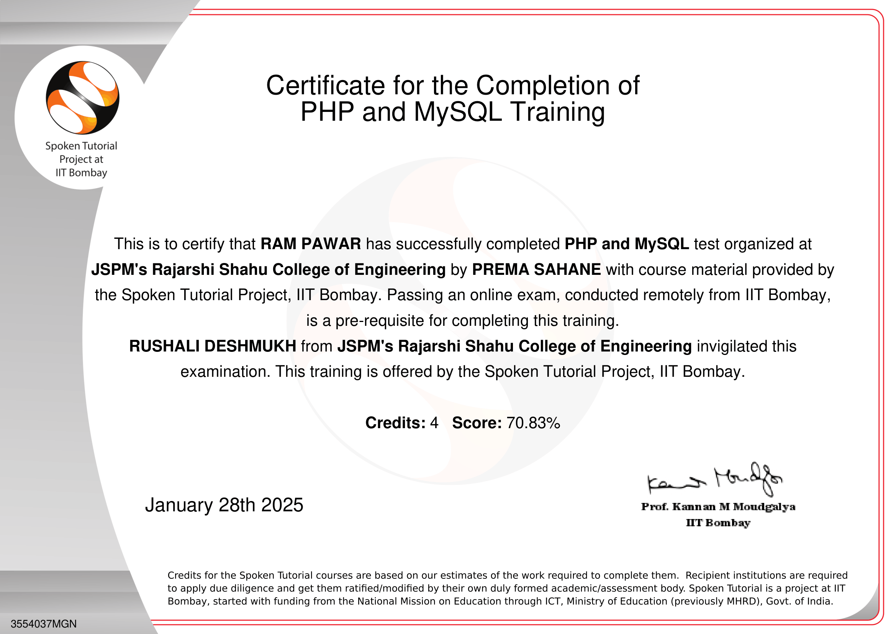
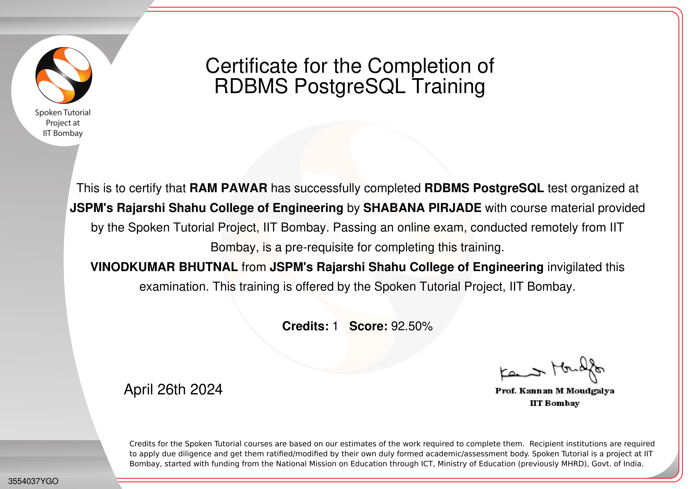
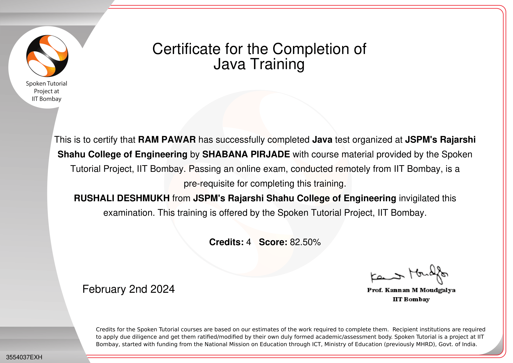
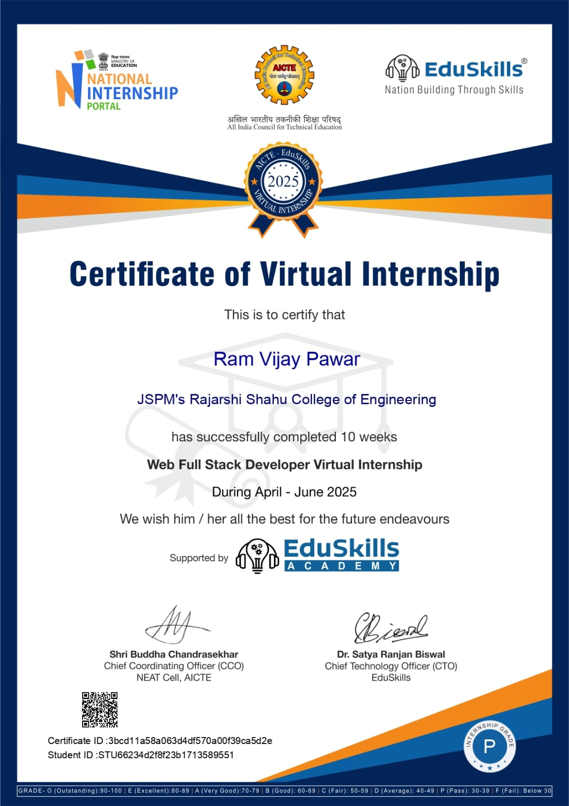

<h1 align="center">
  Hi  I'm Ram Pawar
</h1>

  

  <a href="https://orcid.org/0009-0002-4204-9024">
    
    <strong> ORCID: 0009-0002-4204-9024</strong>
  </a>

---

## 🧠 About Me

<table>
  <tr>
    <td width="50%">
      <ul>
        <li>🎓 <b>Computer Engineering Graduate</b> @ JSPM'S RSCOE, Pune</li>
        <li>💼 Experience: <b>Java Full Stack Trainee Developer</b></li>
        <li>💡 Core Focus: <b>Backend Engineering & Multi-Layered Architectures</b></li>
        <li>👨‍💻 Languages & Frameworks: <b>Java, SQL, Spring Boot, Hibernate</b></li>
        <li>🧩 Solved <b>200+ DSA</b> Problems across LeetCode, TUF & Neetcode</li>
        <li>🚀 Passionate About: Secure, Scalable Web Systems & R&D</li>
      </ul>
    </td>
    <td width="50%">
      
    </td>
  </tr>
</table>

---

## 🏆 Achievements & Highlights

<table>
  <tr>
    <td width="100%" height="100px">
      <ul>
        <li>📜 Registered <b>2 Technology Projects under Indian Copyright Law</b> for proprietary software validation, including <i>“Modern Portfolio With Sleek and Smart Design”</i></li>
        <li>📖 Presented and published an <b>IEEE research paper</b> in IEEE Xplore: <i>“Fake Profile Identification and Reporting for Social Media Platform”</i> (I2ITCON 2025, Pune)</li>
        <li>🧩 Solved <b>200+ DSA problems</b> across platforms to strengthen algorithmic problem-solving skills</li>
      </ul>
    </td>
  </tr>
</table>

---

## 💼 Featured Projects

| Project | Description | Tech Stack |
|:---|:---|:---|
| 🛡️ **Fake Profile Identification** | Built a secure backend REST API with user authentication and a layered architecture that separates business logic from entities. Validated through an IEEE research paper and Indian Copyright registration. | Java, Spring Boot, Spring Security, Spring Data JPA, Hibernate, MySQL |
| 📚 **Online Bookstore System** | Developed a structured backend using Controller, Service, and DAO layers. Includes dynamic cart inventory verification, PBKDF2 password hashing, and Razorpay API verification. | Java, JDBC, Servlets, MySQL, Razorpay API, Java Filters |

---

## 🛠️ Tech Stack

  

---

## 🔢 DSA Contribution

  
  

---

## 🌐 My Portfolio

  

  <b>Explore my portfolio to learn more about my projects, technical skills, experience, and academic work.</b>

  

## 📊 GitHub Stats

  
  <!--  -->

---

## 📚 Certifications

  <b>Selected certifications and training completed across Java, databases, web development, cloud computing, and modern web technologies.</b>

<table align="center">
  <tr>
    <td align="center" width="50%">
      
        
      <strong>Java Full Stack</strong> 
      <em>Kiran Academy | Course Completion | May 2026</em>
    </td>
    <td align="center" width="50%">
      
        
      <strong>Certificate Program in Cloud Computing Engineering (Azure / AWS)</strong> 
      <em>NASSCOM | Gold Category | 97% | June 2026</em>
    </td>
  </tr>
  <tr>
    <td align="center" width="50%">
      
        
      <strong>Complete JavaScript with HTML5, CSS3 from Zero to Expert</strong> 
      <em>Udemy | Completed April 2024</em>
    </td>
    <td align="center" width="50%">
      
        
      <strong>Build Smarter Java Applications: Spring AI and Amazon Bedrock in Action</strong> 
      <em>Infosys | Springboard | June 2026</em>
    </td>
  </tr>
  <tr>
    <td align="center" width="50%">
      
        
      <strong>PHP and MySQL Training</strong> 
      <em>Spoken Tutorial Project, IIT Bombay | 70.83% | January 2025</em>
    </td>
    <td align="center" width="50%">
      
        
      <strong>RDBMS PostgreSQL Training</strong> 
      <em>Spoken Tutorial Project, IIT Bombay | 92.50% | April 2024</em>
    </td>
  </tr>
  <tr>
    <td align="center" width="50%">
      
        
      <strong>Java Programming</strong> 
      <em>IIT Bombay (Spoken Tutorial) | Distinction | 82.50% | February 2024</em>
    </td>
    <td align="center" width="50%">
      
        
      <strong>Web Development</strong> 
      <em>EduSkills Academy</em>
    </td>
  </tr>
</table>

### 🎯 Additional Professional Credentials

- **Web Development Internship** — Cognifyz Technologies, June 2025 to July 2025. fileciteturn1file6L3-L12
- **National-Level Hackathon Participation** — AVINYA 3.0, a 24-hour hackathon held on 5th and 6th February 2025 at JSPM's RSCOE, with team members Atharva Shinde, Nikhil Tarate, and Ram Pawar.
- **National-Level Project Competition Participation** — Logica 4.0, held at JSPM's RSCOE in March 2025.

## 🎤 Conferences

<table>
  <tr>
    <td width="100%">
      <ul>
        <li>📖 Presented and published research paper at <b>I2ITCON 2025, Pune</b> 
          <i>“Fake Profile Identification and Reporting for Social Media Platform”</i> (Published in IEEE Xplore)</li>
      </ul>
       
      

        
        
      

    </td>
  </tr>
</table>

---

## 🔗 Connect With Me

  
  
  

    <a href="https://orcid.org/0009-0002-4204-9024">
      
      ORCID
    </a>

  

